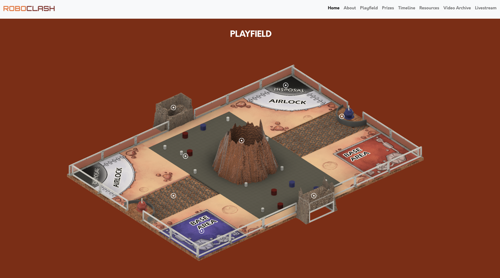

# rc24-autoscore

Auto-scoring system for RoboClash 2024 using Python OpenCV

## Description

The auto-scoring system is split into two main parts:

1. Airlock / Disposal Facilities

These regions on the playfield need to detect rock and pebble game elements for scoring purposes and further point processing.

2. Beacon

This region on the playfield needs to detect the QR code(s) labelled on the flag game elements for scoring purposes.



## Installation

For operating systems other than Windows, follow the [zbar documentation](https://pypi.org/project/pyzbar/) to avoid import errors.

Then, run

```
cd path/to/root
pip install -r requirements.txt
```

## Acknowledgements

This project is an undertaking of RoboClash 2024, organised by the [SUTD Organization of Autonomous Robotics (SOAR)](https://soar.opensutd.org/).
