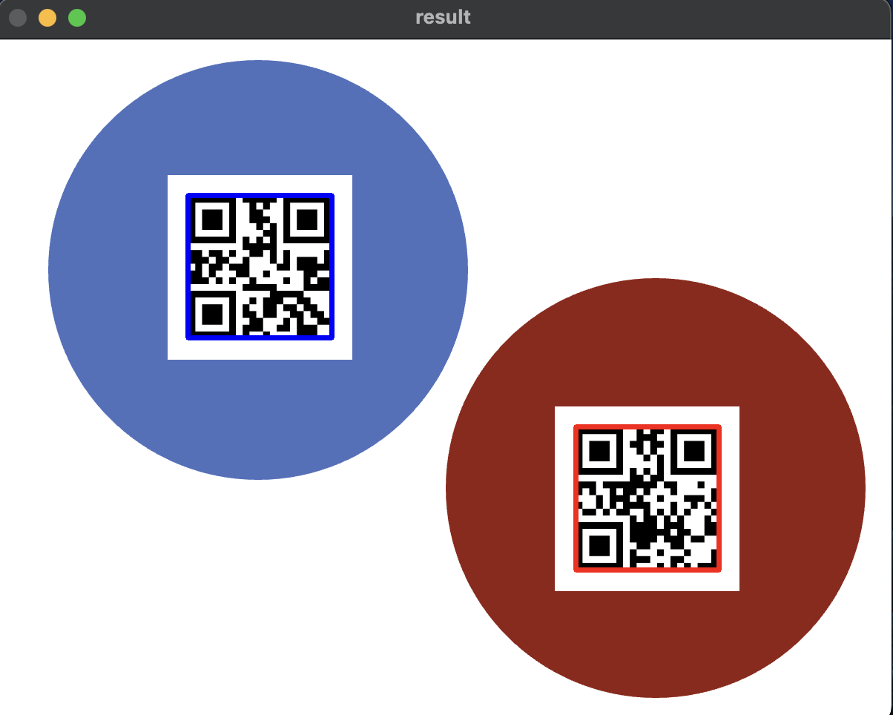
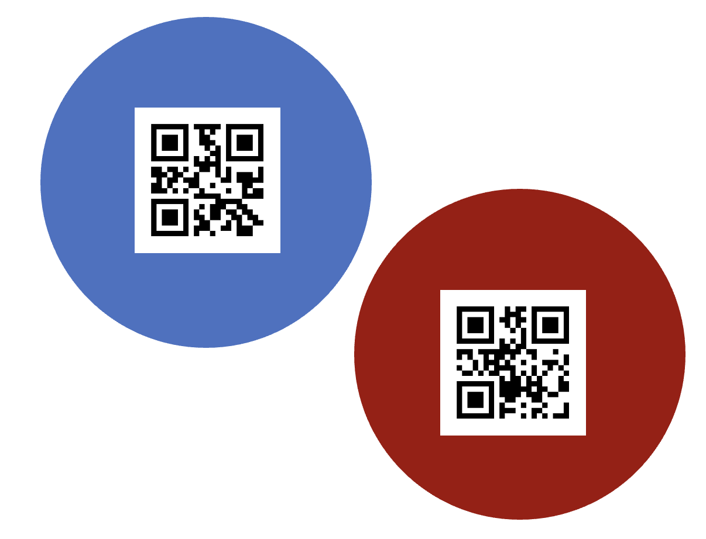

# Detecting Flags

The scripts in this folder are for detection of the flag game elements.

Preview of current results:

## Intructions

Run `main.py` to detect QR codes. You may use `assets/sample.png` for testing.

Press `q` to quit the program or use `Ctrl-C` to terminate the program.

