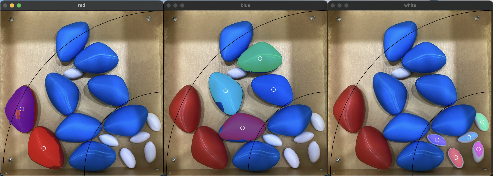
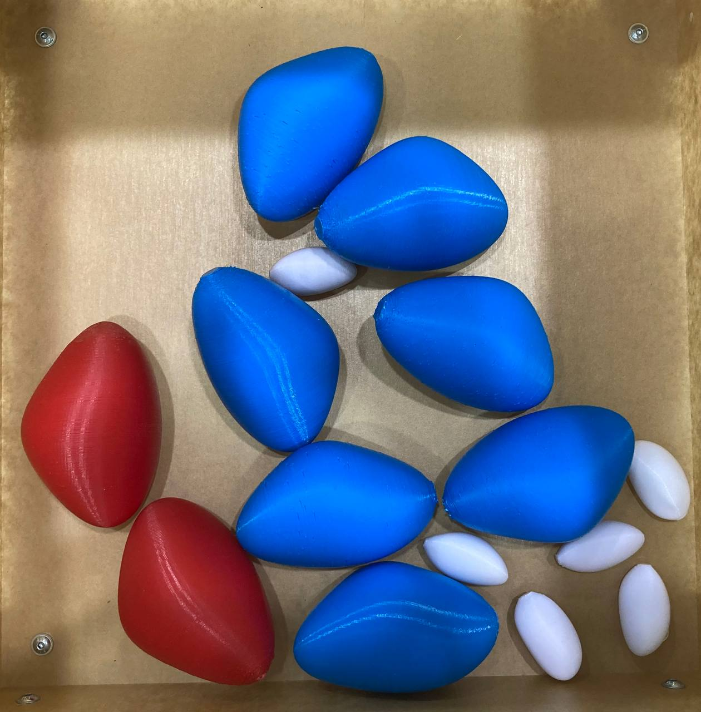

# Detecting Rocks

The scripts in this folder are for detection of the rock game elements.

Preview of current results:

## Intructions

Run `tune.py` on `assets/sample.png` to test the thresholding values for the lower and upper HSV bounds.

Once satisfied, use these values (or use the default values) in `main.py` to run the detection.

For both programs, press `q` to quit the program or use `Ctrl-C` to terminate the program.

